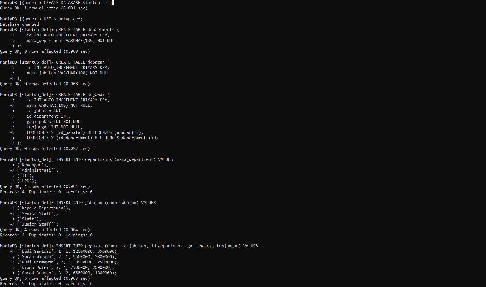

## Modul Tambahan 2
| Laboratorium | Modul 2
|-------|---------
| **NIM**   | 312310576
| **Nama** | Taufik Hidayat
| **Kelas** | TI.23.A6
```
Soal minggu 2
Laporkan Jumlah Gaji dan Gaji Tertinggi Pejabat
dalam array asosiatif dengan format:
Startup DEF ingin membuat laporan gaji pegawai di bagian keuangan. Data pegawai disimpan
$pegawai = [
[
'nama' => 'Nama Petugas",
'gaji_utama' => 8000000, tunjangan' => 2000000
'department' => 'Departemen Perwira',
'name' => 'Nama Petugas Lainnya', 'departemen' => 'Departemen Petugas',
'pohon_gaji' => 10000000,
tunjangan' => 3000000
]
[
// Tambahkan data pegawai lainnya di sini
]
]
Ketentuan:
1. Gaji total dihitung sebagai: gaji_total = gaji_pokok + tunjangan
2. Sistem harus menampilkan laporan setiap pegawai dalam format berikut:
Nama Pegawai: Nama Pegawai
Jabatan: Jabatan Pegawai
Gaji Pokok : Rpxxx.xxx.xxx
Tunjangan: Rpxxx.xxx.xxx
Gaji Total: Rpxxx.XXX.XXX
3. Setelah mencetak laporan setiap pegawai, sistem juga harus: 
4. Menampilkan total seluruh gaji yang dibayarkan perusahaan.
5. Menampilkan nama pegawai dengan gaji total tertinggi, termasuk jumlah gajinya.

Tugas:

1. Buat array berisi data minimal 5 pegawai dengan informasi:
- Nama

- Jabatan

- Gaji pokok

- Tunjangan
2. Buat script PHP untuk mencetak laporan seperti di atas, sekaligus menghitung total seluruh gaji dan mencari pegawai dengan gaji tertinggi
```

#### Buat database Mysql



```
CREATE DATABASE startup_def;
```
```
USE startup_def;
```
#### Buat tabel departments
```
CREATE TABLE departments (
    id INT AUTO_INCREMENT PRIMARY KEY,
    nama_department VARCHAR(100) NOT NULL
);
```
#### Buat tabel jabatan
```
CREATE TABLE jabatan (
    id INT AUTO_INCREMENT PRIMARY KEY,
    nama_jabatan VARCHAR(100) NOT NULL
);
```
#### Buat tabel pegawai
```
CREATE TABLE pegawai (
    id INT AUTO_INCREMENT PRIMARY KEY,
    nama VARCHAR(100) NOT NULL,
    id_jabatan INT,
    id_department INT,
    gaji_pokok INT NOT NULL,
    tunjangan INT NOT NULL,
    FOREIGN KEY (id_jabatan) REFERENCES jabatan(id),
    FOREIGN KEY (id_department) REFERENCES departments(id)
);
```
#### Masukan data
```
INSERT INTO departments (nama_department) VALUES 
('Keuangan'),
('Administrasi'),
('IT'),
('HRD');
```
```
INSERT INTO jabatan (nama_jabatan) VALUES
('Kepala Departemen'),
('Senior Staff'),
('Staff'),
('Junior Staff');
```
```
INSERT INTO pegawai (nama, id_jabatan, id_department, gaji_pokok, tunjangan) VALUES
('Budi Santoso', 1, 1, 12000000, 3500000),
('Sarah Wijaya', 2, 1, 9500000, 2800000),
('Rudi Hermawan', 2, 3, 8500000, 2500000),
('Diana Putri', 3, 4, 7500000, 2000000),
('Ahmad Rahman', 3, 2, 6500000, 1800000);
```
